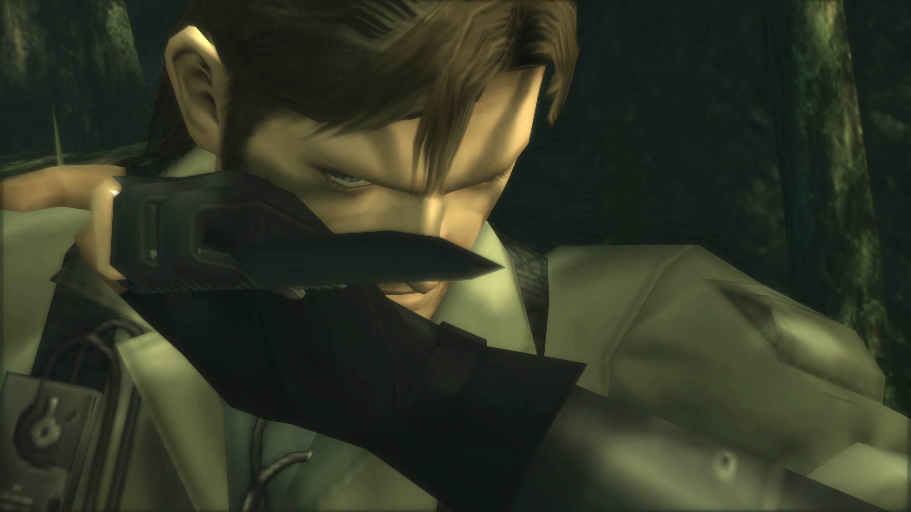
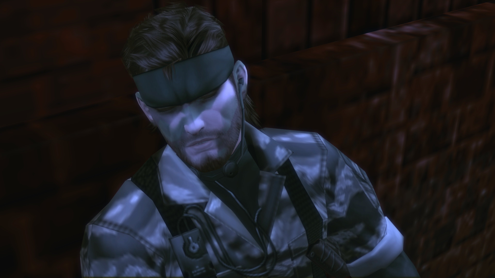
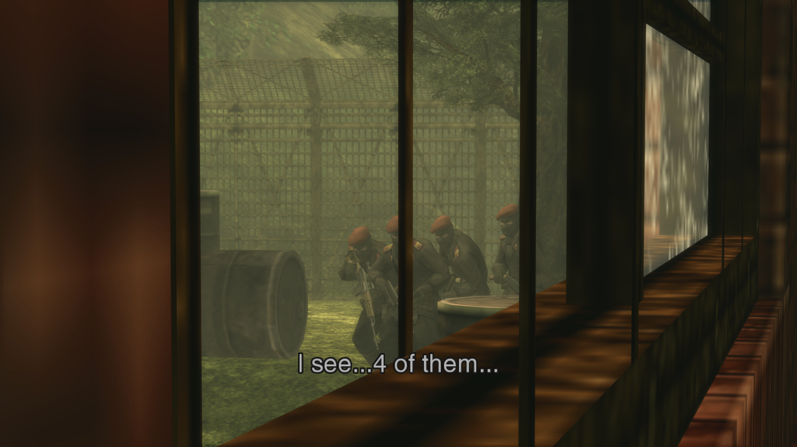

# MGS3 PS2 Demastered (Subsistence Edition)
   

MGS2: [Nexus Page](https://www.nexusmods.com/metalgearsolid2mc/mods/121) | [GitHub Repo](https://github.com/ShizCalev/MGS2-Substance-Edition)

MGS3: [Nexus Page](https://www.nexusmods.com/metalgearsolid3mc/mods/190) | **GitHub Repo (You're already here!)**

 

 

This texture pack for the 2023 PC Master Collection version of Metal Gear Solid 3 fully restores all the game's textures back to their pre-2011 HD Collection / 2005 Subsistence versions, reverting Bluepoint's "remastering", which in many cases was simply Bluepoint lazily running the game's textures through Sony PCL's [Real Scaling for HD](https://gigazine.net/gsc_news/en/20110808_sonypcl_real_scaling_for_hd/) anime upscaler and calling it a day. ([Source on Bluepoint's upscaler](https://i.imgur.com/5H4rZyc.png))

A Snake Eater version will be released at a later date! (There are some minor differences between 2004 Snake Eater -> 2005 Subsistence.)

 

Optional AI Upscaled versions are also available, in some cases the results actually come out better than Bluepoint's upscaling, funnily enough.

 

 

PS2 UI elements, and actual in-world textures are seperated into different downloads for people who want to selectively demaster their game elements. ♥

* UI Textures are not 100% demastered. Weapons / Equipment icons are not yet dumped - tooling needs to be created specifically for those icons as they are a unique format that PCSX2 cannot dump directly.

 

------------

Please report any issues found with the pack, such as textures I might've missed, to our GitHub: [here](https://github.com/ShizCalev/MGS3-Demastered-Subsistence-Edition/issues)

 

## Installation Instructions

1. Download any the latest release zips from: [here](https://github.com/ShizCalev/MGS3-Demastered-Subsistence-Edition/releases)
1. Extract the contents of the zip into your game's folder.

*This pack is complimentary to / requires the [MGS3 Community Bugfix Compilation](https://github.com/ShizCalev/MGS3-Community-Bugfix-Compilation), as it re-imports all the remaining PS2 textures already!

 

## Recommended Mod Load Order (from first to last):

1. [MGSHDFix](https://github.com/Lyall/MGSHDFix) (REQUIRED)
2. [Knight_Killer](https://www.nexusmods.com/profile/KnightKiIIer)'s [MGS3 Better Audio Mod](https://www.nexusmods.com/metalgearsolid3mc/mods/4)
3. [MGS3 Community Bugfix Compilation](https://github.com/ShizCalev/MGS3-Community-Bugfix-Compilation) - Base
4. MGS3 Community Bugfix Compilation - AI Upscaled Texture Pack (if desired)
5. MGS3 Demastered Texture Pack
6. All other mods

 

 

## Examples
| Demastered                                                | Vanilla MC / Bluepoint Remastered                     |
| --------------------------------------------------------- | ----------------------------------------------------- |
|  |  |
|  |  |
|  |  |
|  |  |
|  |  |

--------

Built using [MGS3-PS2-Textures](https://github.com/dotlessone/MGS3-PS2-Textures), made by Afevis.

  

--------

### MGS Master Collection - Community Bug Tracker
- A detailed tracker which catalogs all of the known Master Collection bugs (including issues fixed by MGSHDFix) can be located [here](https://docs.google.com/spreadsheets/d/1WhQSRpkC_A9wBDV0o-Pohh1dMhL1H6nbVzvdluIVWrw/edit?gid=0#gid=0).
- To submit new entries to the tracker, either report a new issue on the MGSHDFix [Github](https://github.com/Lyall/MGSHDFix/issues/new/choose), or use [this form](https://docs.google.com/forms/d/e/1FAIpQLSef8Vx38tHpBsR-dXnawF6X0iad3XU7vmDX29pcmjbaZhQiew/viewform).
